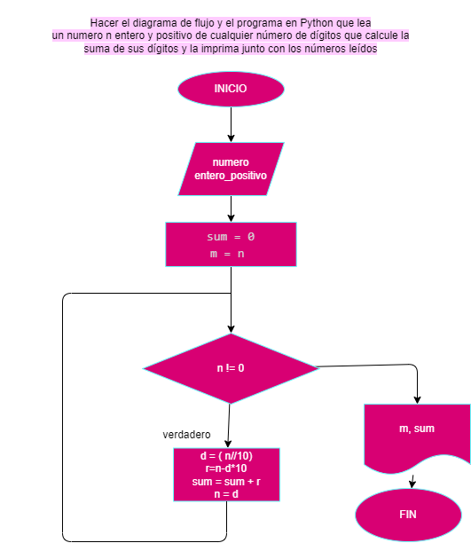

# Hacer el diagrama de flujo y el programa en Python que lea un numero n entero y positivo de cualquier número de dígitos, que calcule la suma de sus dígitos y la imprima junto con los números leídos.

## Diagrama de flujo

 "Diagrama de flujo")