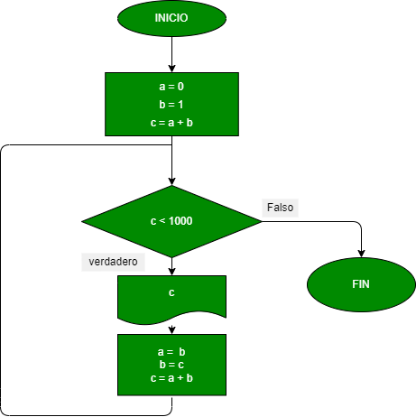

# EJERCICIO 3: -la serie Fibonacci es una secuencia numérica en la cual cada elemento es igual a la suma de los dos anteriores. Tomando como variables iniciales los dos primeros elementos a = 0 b=1, hacer el diagrama de flujo y el programa en Python, que calcule e imprima a partir del tercero, todos los elementos de la serie de Fibonacci todos los números menores de mil

## Diagrama de flujo

 "Diagrama de flujo")