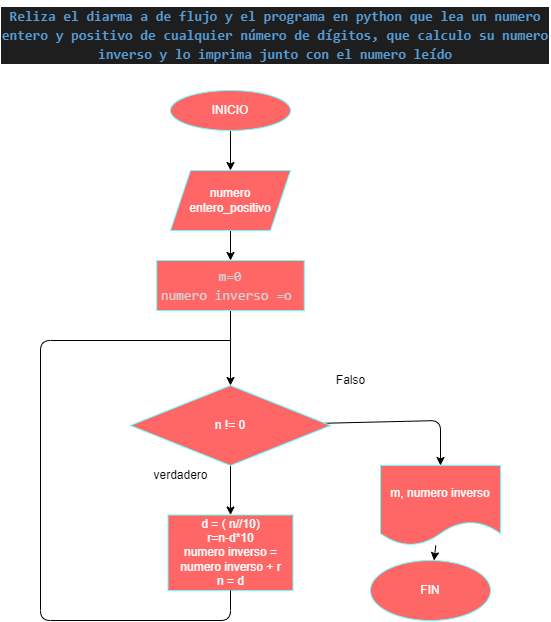

# Hacer el diagrama de flujo y el programa en Python que lea un numero entero y positivo de cualquier número de dígitos, que le calcule su numero inverso y lo imprima junto con el numero leído.

## Diagrama de flujo

 "Diagrama de flujo")